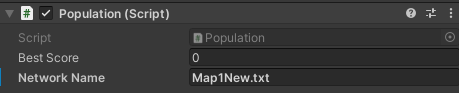
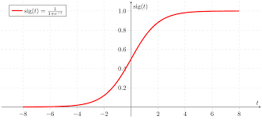
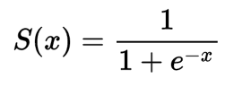
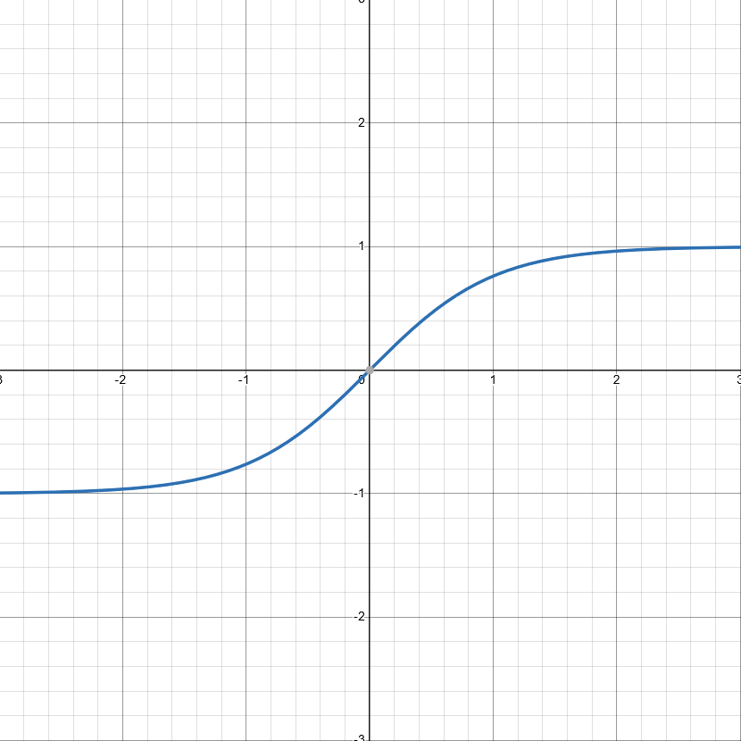
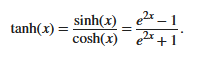
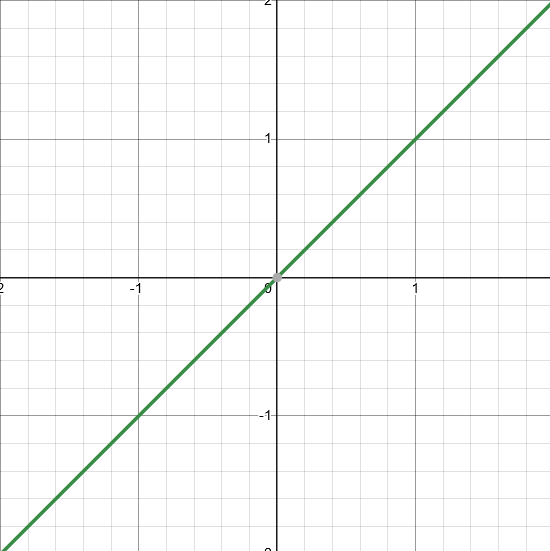
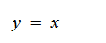
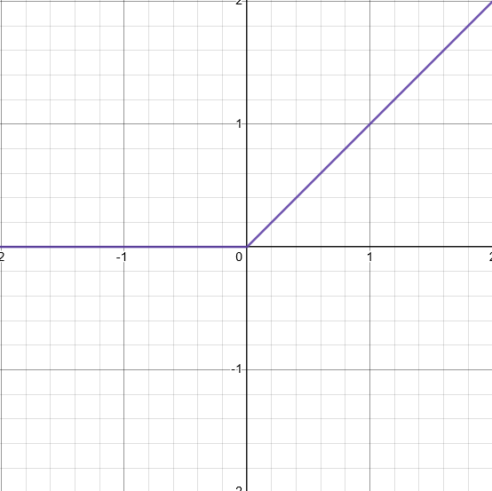
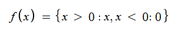

# Genetic Algorithm Neural Network Package

***

#### Table of Contents
- [Breakdown of Package](#breakdown-of-the-redistributable-code)
    - [Network](#network)
    - [Neuron](#neuron)
    - [Connection](#connection)
    - [Population](#population)
    - [AIPlayer](#aiplayer)
    - [Visual](#visual)
- [Racing Game Example](#the-racing-game-example)
    - [Inputs](#inputs)
    - [Outputs](#outputs)
    - [Activation Function](#activation-function)
    - [Fitness Score](#fitness-score-calculation)

***

## Breakdown of the redistributable source code

This package includes the scripts to create a neural network that evolves through a genetic algorithm. The provided scripts will allow a user to create an evolving AI.
In the scripts folder you will find six scripts. The neural network consists of the Network, Connection and Neuron scripts. These hold the core structures of the system
and will generate the network. The population script takes care of all the AI. This includes their updates, fitness levels and crossbreeding.

### Network

The network script includes the functionality for creating a network with the given amount of inputs, outputs and hidden layer nodes. It handles ordering the network
for use during the feed forward process and also connects the neurons to other neurons based on the connections. There is also a cloning function that is used to
avoid AI from behaving exactly the same.

### Neuron

The neuron script does all the calculations in regards to the inputs. When an input value is given to the neuron it will take is and push it through an activation
function. Currently, many different activation functions exists in the script. You should select which one suits your situation better. We will go through a
simple selection process when talking about the example program that was made with this package.

### Connection

The connection script holds the data for the weights of the network. A network will have many connections joining the neurons from one layer to another. A connection
keeps track of the neuron it is connecting to and the neuron it is connecting from. It also keeps the weight of the connection. This weight will determine the
importance of this output value and will influence the output values from each neuron. The connection has the functionality to mutate where the weight will change.
This can be changed in the script as this is not revealed anywhere in the Unity editor. `drasticMutateChance` is the chance for a large mutation to happen where
the weights of a connection will randomly change. `mutateChance` is the chance for a weight to change according to the `rangeOfMutation`. This is a more controlled
mutation.

### Population

The population script will grab all objects tagged by the Robot tag. This tag can be anything as it is only used to keep track of what objects is an AI. If their
is already a data file for the given `networkName`, the script will load the network and apply it to the current training session. 

> The network name is the text file's name that stores the data of the network. This is set in the inspector on the population script.

  

If there isn't a text file with the same name, it will generate a new text file to store the network in. The population script also keeps a copy of the 
`bestScore` of this session, the `prevBestScore` (previous best score) and the `bestPlayer` of the session. If a file is read during startup, the 
default `bestPlayer` will be the copied network.

When all AI have reached the time limit or have died, the script will calculate the AIs fitness scores and sort them according to the best fitness scores. It
will then crossbreed this generations best player, and the saved best player and produce a new network with spliced weights. It will then repopulate the AI
with some of the best players, and some of the breeded product.

There are some buttons that allow for more supervised learning. The user can kill all current AI, save the best AI or reset the best fitness score. Resetting
the best fitness score can lead to some unwanted learning but can also get the AI to break out from a repetition.

### AIPlayer

This script is where the network will reside. This script will feed forward some inputs to the network and take the output and pass it to another script that
will act according to those outputs. The values that can be changed are in the `AIStats` scriptable object. The `amountOfInputs` is the amount of input nodes
the network has. This is the same for the `amountOfOutputs` and `amountOfHiddenNodes`. These three variables affect how the network looks. Here the AIPlayer will
do two things. It will assess and then perform.

Assessing the situation is the process of gathering the required inputs for the network to use. It will take those values, put them into a list and pass it 
through to the network so it can feed forward. The amount of required inputs must equal the amount of input nodes. The required values will change with each game.

Performing actions is when the network passes the output it gets from the feed forward process and sends it to the required script. That script then uses
those values to determine what actions need to be made.

This script is where the user must create their own inputs and outputs based on the requirements.

### Visual

Visual is still a work in progress. This script is designed to display a given network with their nodes and connections in the UI. Currently, the nodes
will change colour according to its activation but it is yet to be functional.

***

## The Racing Game Example

This package comes with a racing game example. This will break down what the user needs to do to build and train their network. The core parts that the user
must complete is the handling of inputs, outputs, activation function and fitness scores. The racing game goes through each of these sections in a simple 
way.

***

***KEEP IN MIND, GENETIC ALGORITHM NEURAL NETWORKS WILL GENERATE THE SOLUTION IT THINKS IS THE BEST AND WILL NOT ALWAYS BE THE SAME AS THE SOLUTION YOU WANT***

***

### Inputs

Inputs are what the network uses to come to a conclusion on what to do in a situation. These are passed into the network and fed forward to come to some
number of outputs. The inputs must be quantifiable (stored in a float) and exist in a range between 0 and 1. In the racing game example, the inputs that
the car takes are distances to walls from its position. This is calculated using raycasts. The amount of inputs is the same as the amount of raycasts
shot from the car. These distances are then divided by the largest distance to fit a value between 0 and 1. What this means is if the distance is far
away, the value will be higher and if the distance is close, the value is smaller. This is all in a ratio of the largest distance to keep consistency. 
This is what the car uses to make decisions.

In another thought case, in a fighting game, the network would need to know the position of the enemy, velocity, inputs, enemy health, own health and
many more. The positions x and y can be fed through, the velocity can also be broken down into x and y. The enemies inputs can be 0 or 1 depending on
whether it is pressed or not. The health values can be passed through as decimals based on max health. These are only a few of the inputs a fighting
game could use to train a network.

### Outputs

Outputs are what the network passes to another script for it to perform specific actions. In the racing game, the outputs are passed to a `Car` script
that determines how the car moves. In the racing game example, their are 2 outputs that the car needs. The forwards movement and the turn movement
known as `directionOfMotion` and `amountOfTurn` respectively. These are used in the cars movement functions `ForwardMovement` and `TurnMovement` where
the car will move according to the outputs the network generates. This is seen in the `AICar` scripts function `Drive` which takes in the outputs the
network supplies and uses those to drive. The outputs can be manipulated however you want. This is seen in the `Drive` function where the input for
the turn fuction is multipled by a turn speed.

Continuing on from the thought case, a fighting game will have outputs mapped to each of the buttons that can be inputted by a player. The outputs
that are expected from the network will toggle the buttons based on the value. An example of this is if the output for the button *x* is 0.8. Since
the value passes the threshold of lets say 0.65, the button will be pushed. For the button *o* the output value was 0.2 so the button is not pressed.
This is another way outputs can be used. The raw output value can be used or the output value can be compared to a threshold and then used.

### Activation Function

Picking an activation function will vary with each game. They all output different clamped values of the input and will drastically change how
your network functions. There are many different kinds of activation functions and further research will need to be done to decide on which
onw you will need. In the `Neuron` script, there are many activation functions available for use already. These are the Sigmoid, Tanh, Linear,
and ParametricRectifiedLinear functions. Just change the activation function in `SendOutput` to the one you need.

The sigmoid function returns a value between 0 and 1. This can be used in networks that require the output to affect a toggleable item or you
always want a positive value even if the input is negative. This is handy if you want to emulate a player and how they use a controller.
Just like the example fighting game, a sigmoid activation function can be used to imitate button presses for each move a character has.

  

  

The tanh function returns a value between -1 and 1. This function is good in the cases where negative values are required. In this racing
game, the forward and turn movement is altered depending on this value. If the output for forward is positive, it will go forward. If the output
is negative, it will go backwards. If the value is large, it will move fast and if the value is small it will move slowly. The output
for turning will get an angle based off a max turn angle and rotate the car by that amount. For example, the max amount of degrees you
can turn is 90 degrees. Depending on the output value, the turn amount will be affected.

  

  

The linear functions will return a value changed based on the gradient of the line. Usually the linear function will have a gradient of
one and the output value will not change. This is useful if your outputs do not need to be clamped between two values. The rectified linear
version will set every output less than 0 to 0 and keep any value above 0 unchanged.

  

  

  

  

### Fitness Score Calculation

The fitness score is how you rank the performance of your AI agents. This will change depending on each game. In the racing game, the 
fitness score was a summation of the distance it has travelled between each goal. This way of calulating the fitness score is useful
for guiding the agent in the direction you want it to go. This is a very supervised way of learning as goal points were put on the
track in the direction you wanted the agents to go. Different ways to affect this value without actually changing the required
calculation is reducing the amount of time the agent can stay alive. This made the agent have to go faster to reach each checkpoint.
This is an example of ways to get wanted behaviours from the agents.

In a fighting game, the fitness score could be comprised of your health, the enemy health and time left. This could be a good way for
the AI to evolve so that it keeps its health high, the enemy's health low, and do it as fast as possible.

Fitness scores will ultimately affect how the weights of the connections change according to the importance of each factor when
calculating the fitness score. 
